# Austin Animal Center Shelter Visualization
Try it here!
https://EnguangShi.github.io/Austin-Animal-Center-Shelter-Visualization/

## 1 Basic Info

 \
**Austin Animal Center Shelter**

 \
**Enguang Shi**

**Gloria Wang**

**Meihui Li**

**Demo link:**

**[https://www.youtube.com/watch?v=EwslXFIbVV4](https://www.youtube.com/watch?v=EwslXFIbVV4)**

## 2 Overview

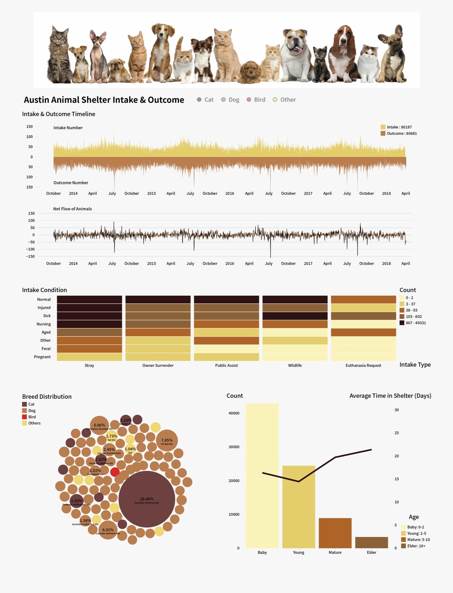

As of 2021, the pet ownership rate in North America is estimated to be around 68% of households. This includes ownership of dogs, cats, birds, fish, reptiles, and other animals. Where do people get their pets? Would high pet ownership lead to a high rate of surrendering animals? The data from Austin Animal Center intake and outcome could help us approach the issue of animal welfare and operation conditions of animal shelter. It would help both shelter staff and people who want to get a pet to make better decisions in adopting pets.

## 3 Data and Data Preprocessing

3.1 Description of data

* The dataset contains information on animal intakes and outcomes at the Austin Animal Center, which is the largest no-kill animal shelter in the United States. The data covers the period from October 2013 to March 2018. Each record represents a unique animal intake or outcome and includes information. The primary key is combination of animal_ID & intake_number.
* link: [https://www.kaggle.com/datasets/aaronschlegel/austin-animal-center-shelter-intakes-and-outcomes?resource=download](https://www.kaggle.com/datasets/aaronschlegel/austin-animal-center-shelter-intakes-and-outcomes?resource=download)

    Total number of items: ~80k

<table>
  <tr>
   <td>
<strong>Field name</strong>
   </td>
   <td><strong>Attribute type</strong>
   </td>
   <td><strong>Cardinality</strong>
   </td>
   <td><strong>Range</strong>
   </td>
   <td><strong>New attributes?</strong>
   </td>
  </tr>
  <tr>
   <td>animal_ID
   </td>
   <td>categorical
   </td>
   <td>~72k
   </td>
   <td>
   </td>
   <td>Yes, combine income ID & outcome ID to one attribute
   </td>
  </tr>
  <tr>
   <td>intake_number
   </td>
   <td>quantitative
   </td>
   <td>
   </td>
   <td>1-13
   </td>
   <td>No
   </td>
  </tr>
  <tr>
   <td>animal_type
   </td>
   <td>categorical
   </td>
   <td>4
   </td>
   <td>
   </td>
   <td>No
   </td>
  </tr>
  <tr>
   <td>intake_condition
   </td>
   <td>categorical
   </td>
   <td>8
   </td>
   <td>
   </td>
   <td>No
   </td>
  </tr>
  <tr>
   <td>intake_type
   </td>
   <td>categorical
   </td>
   <td>5
   </td>
   <td>
   </td>
   <td>No
   </td>
  </tr>
  <tr>
   <td>age_upon_intake_age_group
   </td>
   <td>categorical
   </td>
   <td>10
   </td>
   <td>
   </td>
   <td>No
   </td>
  </tr>
  <tr>
   <td>intake_monthyear
   </td>
   <td>quantitative
   </td>
   <td>
   </td>
   <td>30Sep13-

28Feb18
   </td>
   <td>No
   </td>
  </tr>
  <tr>
   <td>time_in_shelter_days
   </td>
   <td>quantitative
   </td>
   <td>
   </td>
   <td>0-1600
   </td>
   <td>No
   </td>
  </tr>
  <tr>
   <td>outcome_type
   </td>
   <td>categorical
   </td>
   <td>9
   </td>
   <td>
   </td>
   <td>No
   </td>
  </tr>
  <tr>
   <td>age_upon_outcome_age_group
   </td>
   <td>categorical
   </td>
   <td>10
   </td>
   <td>
   </td>
   <td>No
   </td>
  </tr>
  <tr>
   <td>outcome_monthyear
   </td>
   <td>quantitative
   </td>
   <td>
   </td>
   <td>30Sep13-

31Mar18
   </td>
   <td>No
   </td>
  </tr>
  <tr>
   <td>breed
   </td>
   <td>categorical
   </td>
   <td>~2000
   </td>
   <td>
   </td>
   <td>No
   </td>
  </tr>
  <tr>
   <td>color
   </td>
   <td>categorical
   </td>
   <td>~500
   </td>
   <td>
   </td>
   <td>No
   </td>
  </tr>
  <tr>
   <td>sex_upon_intake
   </td>
   <td>categorical
   </td>
   <td>5
   </td>
   <td>
   </td>
   <td>No
   </td>
  </tr>
  <tr>
   <td>sex_upon_outcome
   </td>
   <td>categorical
   </td>
   <td>6
   </td>
   <td>
   </td>
   <td>No
   </td>
  </tr>
</table>

## 3.2 Data Preprocessing

The data processing was done through JavaScript in the main.js, bubble.js and lines.js file, and includes:

1. Round the Age to whole years

2. Converting number strings Days to integer values

3. Group the corresponding data for visualization use.

4. Create new age group column based on age conditions

5. Join two intake & outcome csv files for line chart use

## 4 Tasks

<table>
  <tr>
   <td>domain-specific
   </td>
   <td>abstract language
   </td>
  </tr>
  <tr>
   <td>An animal shelter staff wants to 

view the flow of animals in the shelter every month and find the potential extreme influx/outflux
   </td>
   <td>{Locate, Outlier}

{Compare, Trend}
   </td>
  </tr>
  <tr>
   <td>A potential animal adopter wants to find the main breeds of animals in the shelter to decide what kind of pet they could find in the shelter
   </td>
   <td>{Discover, Distribution}
   </td>
  </tr>
  <tr>
   <td>An animal shelter staff want to find which age group of animals are staying the longest in the shelter
   </td>
   <td>{discover relationships}
   </td>
  </tr>
</table>

## 5  Visualizations

5.1 Animal type filter

Visual Encoding

<table>
  <tr>
   <td>Attribute
   </td>
   <td>Type
   </td>
   <td>Marks
   </td>
   <td>Channel
   </td>
  </tr>
  <tr>
   <td>Animal Type
   </td>
   <td>Categorical
   </td>
   <td>point
   </td>
   <td>color
   </td>
  </tr>
</table>

Design Rationale

We want to create this general filter and put it on the first of the page to let users find it and use it. We choose the same color hue with 5.5 bubble plot to enhance the impression of difference between animals.

Interaction

Creating a filter

The UI widget type filter could filter one or more animals to view 5.3 Line Chart of Net Flow of Animals, 5.4 Heat Map, 5.5 bubble plot and 5.6 Bar chart of Age Group VS Line chart of average Days in Shelter. In default, the four animals are all deselected and all categories are shown. 

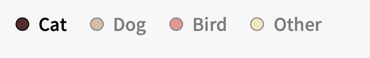

After the user clicks on an animal, it becomes active and all other categories are hidden in the chart. Users should be able to select multiple categories and a second click on an active category sets it inactive.

Filter Combination

	5.1 type filter could be used together with any one of 5.2 stack brush, 5.4 heatmap selector, 5.5 bubble plot selector and 5.6 bar chart selector

5.2 Stacking-line graph with brush showing intake and outcome count

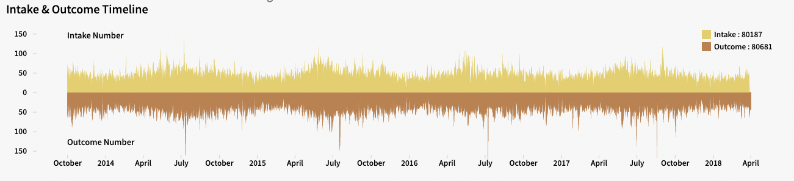

Visual Encoding

<table>
  <tr>
   <td>Attribute
   </td>
   <td>Type
   </td>
   <td>Marks
   </td>
   <td>Channel
   </td>
  </tr>
  <tr>
   <td>Animal intake number
   </td>
   <td>quantitative
   </td>
   <td>point
   </td>
   <td>area
   </td>
  </tr>
  <tr>
   <td>Animal outcome number
   </td>
   <td>quantitative
   </td>
   <td>point
   </td>
   <td>area
   </td>
  </tr>
  <tr>
   <td>Ttrend of intake number by time
   </td>
   <td>quantitative
   </td>
   <td>line
   </td>
   <td>shape
   </td>
  </tr>
  <tr>
   <td>Trend of outcome number by time
   </td>
   <td>quantitative
   </td>
   <td>line
   </td>
   <td>shape
   </td>
  </tr>
</table>

Design Rationale

In order to effectively display the intake and outcome numbers of an animal shelter, we have chosen to use a split stacked line graph, with time on the x-axis and animal numbers on the y-axis. The use of positive values for intake numbers and negative values for outcome numbers provides an easy way for viewers to understand the net change in animal numbers over time. Additionally, the shape of the intake and outcome lines can provide valuable insights into trends and patterns that may be useful for making decisions about adoption campaigns or outreach efforts.

To increase the clarity of the chart, we have employed a color scheme with two distinct colors to differentiate between intake and outcome data. This helps viewers quickly identify which sections of the chart correspond to each data point. Furthermore, we have added a hidden line to show data for selected types, which only appears when the user selects at least one type. This provides a more personalized and informative view of the data, allowing viewers to focus on specific types of animals or other factors of interest.

To provide a more comprehensive understanding of the data, we have also included a legend on the chart, which allows viewers to easily read the total intake and outcome numbers for the current time range. These design choices make our chart more user-friendly and informative, helping viewers to quickly and easily understand the data being presented.

Interaction

Creating a filter

* Filter the time and interact with other views

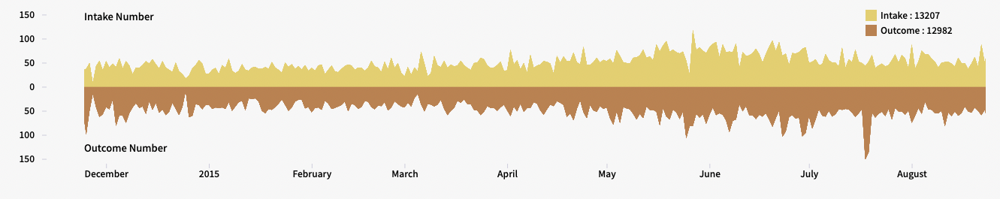

When a user slelcts a time range, the stacked line graph, line chart of net flow, bar chart, bubble plot and heatmap will all show the data accordingly. And when we click the blank space, the timeline will change back to the default time domain. Also, other filters except 5.1 type filter would be eliminated.

Filter Combination

	5.2 stack brush could be used together with 5.1 type filter, then any one of 5.4 heatmap selector, 5.5 bubble plot selector and 5.6 bar chart selector. However, the user must first choose 5.2 stack brush, then use 5.4 / 5.5 / 5.6 filter. The pre-existing 5.4 / 5.5 / 5.6 filter would be eliminated after using 5.2 stack brush

Receving Filter from Other Views 

	Filter a specific animal type and interact with other views 

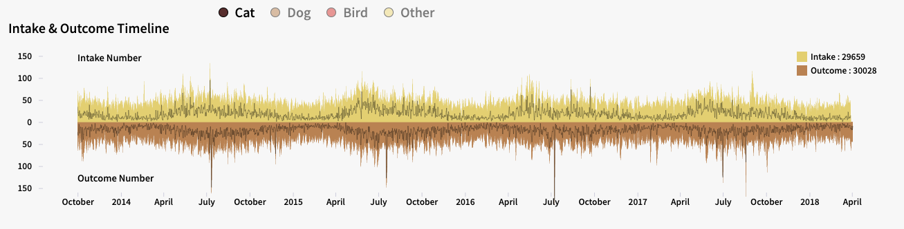

When we click a type, the stacked line graph will generate an intake line and a outcome line of the animal type that we select so that the we can see the intake and outcome trend of this animal type. If we select more than one type, the lines will show the general trend of types selected.

5.3 Line Chart of Net Flow of Animals

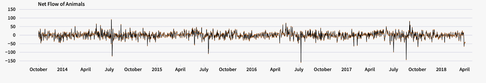

Visual Encoding

<table>
  <tr>
   <td>Attribute
   </td>
   <td>Type
   </td>
   <td>Marks
   </td>
   <td>Channel
   </td>
  </tr>
  <tr>
   <td>Animal net count
   </td>
   <td>quantitative
   </td>
   <td>point
   </td>
   <td>line
   </td>
  </tr>
  <tr>
   <td>Trend of net count
   </td>
   <td>quantitative
   </td>
   <td>line
   </td>
   <td>shape
   </td>
  </tr>
</table>

Design Rationale

We use line graph to show the net flow of animals in an animal shelter over time. With time on the x-axis and net animal numbers on the y-axis, this graph allows viewers to easily see the net change in animal numbers over time. By using a line graph in this way, users can quickly identify trends and patterns in animal intake and outcome, and track changes in the overall animal population of the shelter.

Furthermore, the plot points on this graph provide detailed information about the net flow and trends of animals in the shelter. By examining the position of the plot points, viewers can identify when there were periods of high or low animal intake or outcome, and how these factors impacted the overall animal population of the shelter. This information can be used to inform decision-making about adoption campaigns, outreach efforts, and other strategies to manage animal populations in the shelter.

Interaction 

Tooltip 

When a user mouseover a point, it would hover and show a tooltip with the number and date of this point. When user selects a type, the Type field on the tooltip will change accordingly.

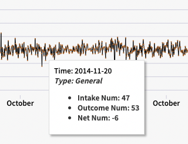

Receiving a filter from other views

* when filter specific animal types

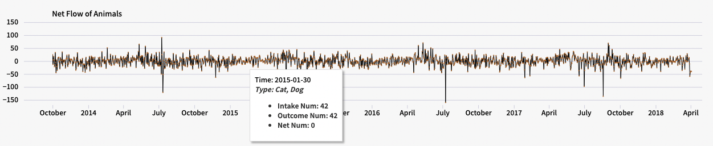

When we click a type, the net  line graph will show the data of the animal type that we select so that the we can see the net trend of this animal type. If we select more than one type, the lines will show the general trend of types selected.

* when filter specific time range

When we filter a time range in stacked line graph, the line chart will show data accordingly.

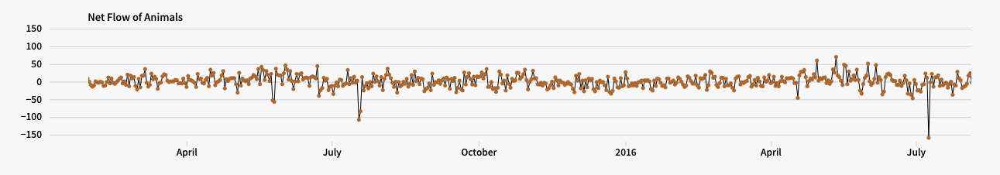

5.4 Heat Map of Intake Condition VS intake Type VS Count

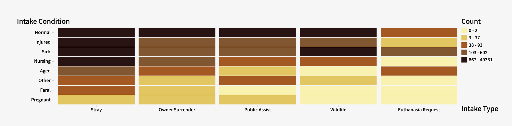

Visual Encoding

<table>
  <tr>
   <td>Attribute
   </td>
   <td>Type
   </td>
   <td>Marks
   </td>
   <td>Channel
   </td>
  </tr>
  <tr>
   <td>Intake Condition
   </td>
   <td>categorical
   </td>
   <td>point
   </td>
   <td>position on common scale
   </td>
  </tr>
  <tr>
   <td>Intake Type
   </td>
   <td>categorical
   </td>
   <td>point
   </td>
   <td>position on common scale
   </td>
  </tr>
  <tr>
   <td>Animal Count
   </td>
   <td>quantitative
   </td>
   <td>point
   </td>
   <td>color hue
   </td>
  </tr>
</table>

Design Rationale

We use the x-axis of the heatmap to represent different intake types, and the y-axis to represent various intake conditions. Each cell represents a combination of an intake type and condition. The color of each cell is divided into five levels from light to dark, with lighter colors indicating less frequent occurrences in the database and darker colors indicating more frequent ones. To aid interpretation, we included a legend displaying quantity ranges corresponding to each color on the current heatmap.

To optimize user comprehension and aesthetic appeal, we made several design choices:

* We chose common dog colors for better visual appeal while ensuring that users can easily distinguish between lighter and darker shades. 
* We placed frequently occurring intake types and conditions in the upper left corner so that cells with darker colors are more likely to be located there.
* Evenly distribute colors throughout the heatmap by ordering cell counts into 5 groups.
* Combine groups with overlapping count ranges when ties occur during grouping (e.g., combining groups with count ranges from 0-1 and 1-2).

Interaction (DONE)

Creating a filter:

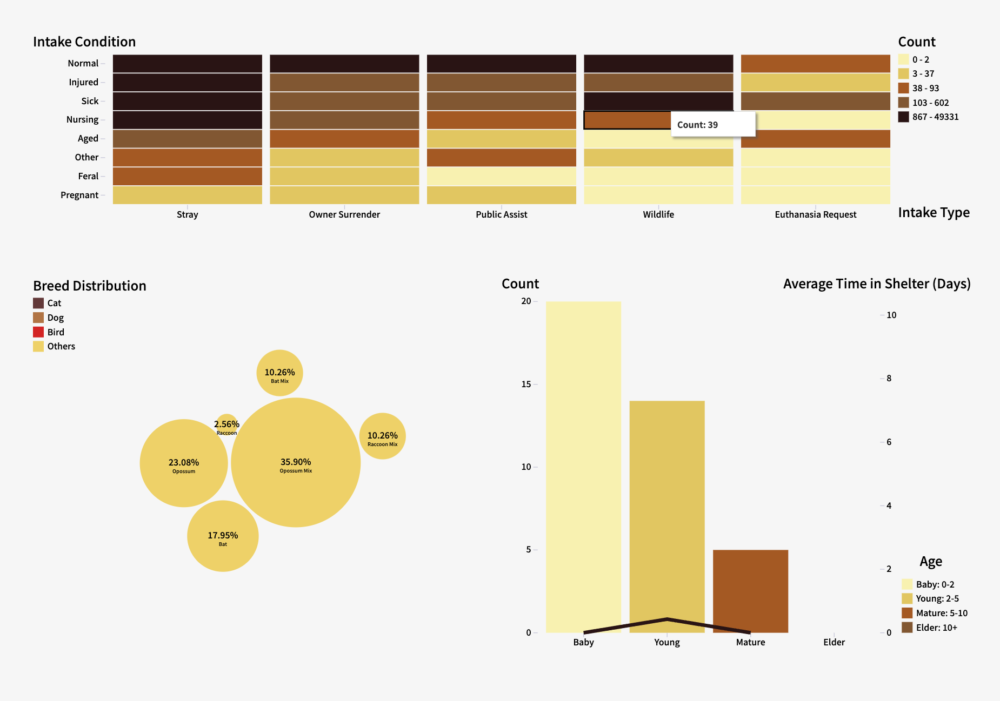

    When a user clicks on a cell in the heatmap, it filters the data based on the combination of intake condition and intake type. The cell will be lightlighted with a black border. The filter is applied to the bubble chart to display the breed distribution of animals that fall under this combination of intake condition and intake type. The filter also applies to the bar & line chart, which shows the count and average time in shelter for different age groups of animals that fall under this combination of intake condition and intake type. Cells with a count of 0 cannot be clicked because there is no data available for this particular combination.

Filter Combination

	5.4 Heat Map selector could be used together with 5.1 type filter, and if there is a selected 5.2 stack brush, the user could use 5.5 based on 5.2 selection.

Receiving a filter from other views:

    
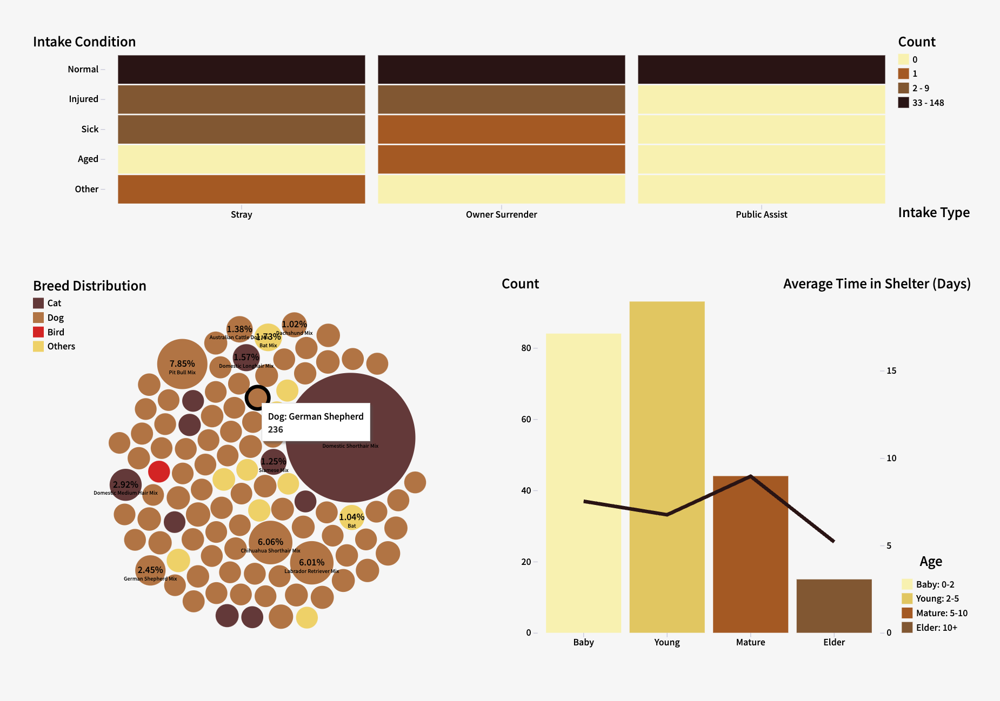

    The heatmap can receive filtered data from all the other filters in the app. When receiving filtered data from other charts, the heatmap will adjust accordingly by changing its rows and columns based on how many intake conditions/types are present. Additionally, color groups will be distributed evenly without overlap, while frequently occurring conditions/types will appear in the upper left corner after recalculations are made using new data.

Hover & Tooltip (DONE)

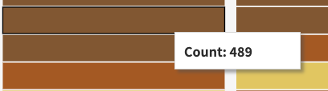

When a user mouseover a cell, it would hover and show a tooltip with the count of this combination of intake type and condition.

5.5 Bubble plot of Breed Distribution

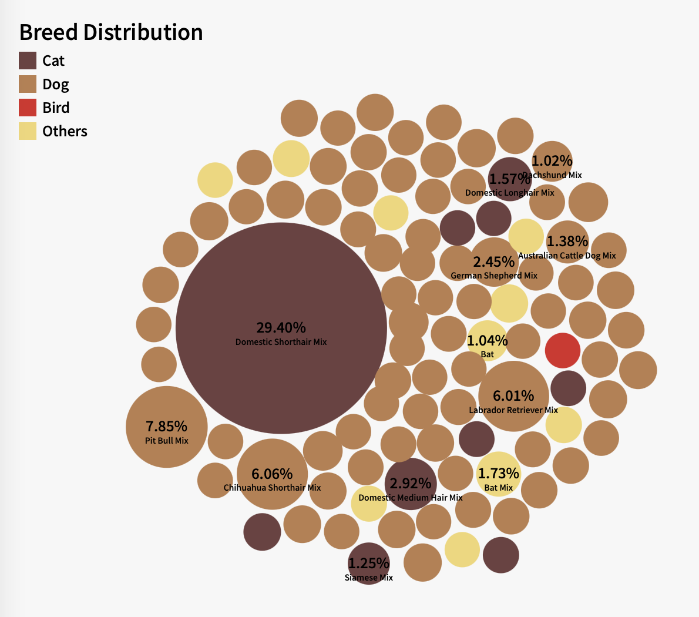

Visual Encoding

<table>
  <tr>
   <td>Attribute
   </td>
   <td>Type
   </td>
   <td>Marks
   </td>
   <td>Channel
   </td>
  </tr>
  <tr>
   <td>Breed
   </td>
   <td>Categorical
   </td>
   <td>show in tooltip
   </td>
   <td>show in tooltip
   </td>
  </tr>
  <tr>
   <td>Animal type
   </td>
   <td>Categorical
   </td>
   <td>show in tooltip
   </td>
   <td>Color hue
   </td>
  </tr>
  <tr>
   <td>Animal Count
   </td>
   <td>quantitative
   </td>
   <td>interlocking areas/show in tooltip
   </td>
   <td>2D size,radius
   </td>
  </tr>
  <tr>
   <td>Animal Percentage
   </td>
   <td>quantitative
   </td>
   <td>interlocking areas
   </td>
   <td>2D size,radius
   </td>
  </tr>
</table>

Design Rationale

Bubble chart is used because we want to show both breed distribution and animal types in one chart. We select top 100 (or smaller than 100) breeds to show in the chart. When a user looks at the chart, they could first see the breed greatest percentage of count. Then, they could see the name of breeds that have the percentage larger than 1%, which compose the main breeds in the shelter. they could also differentiate animal types by color hue. While size coding is considered a medium effective channel, we give the count of animals in the tooltip to compare the similar size bubbles.

Interaction

Hover & Tooltip 

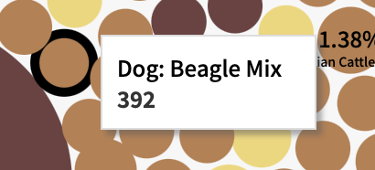

	When a user mouseover a bubble, it would hover and show a tooltip with animal type, breed name and count.

Creating a filter

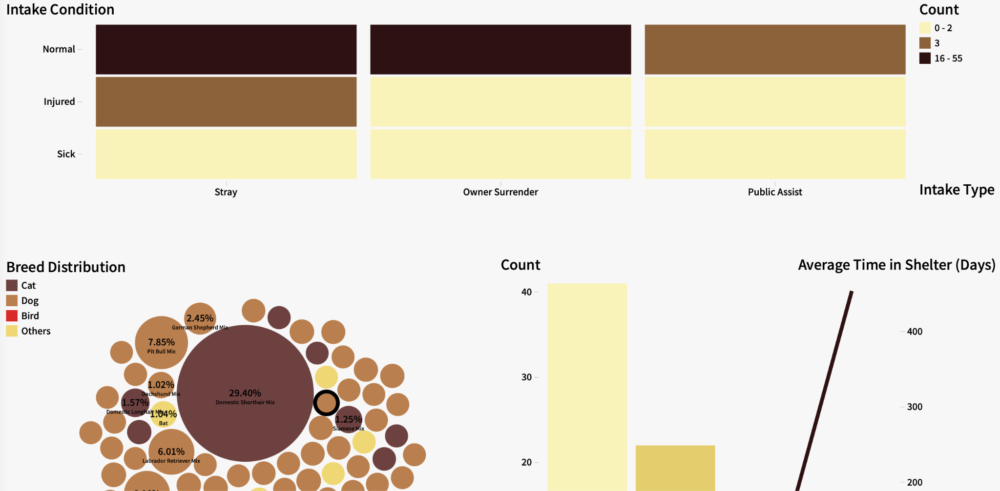

	When a user clicks a bubble, the bubbled would be hovered. Then 5.6 Bar chart & 5.4 Heat Map would be filtered with only this breed’s data.

Filter Combination

	5.5 bubble plot selector could be used together with 5.1 type filter, and if there is a selected 5.2 stack brush, the user could use 5.5 based on 5.2 selection.

	

Receiving a filter

1. Filter Animal Type 

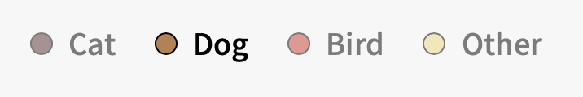

	The user could use the four buttons corresponding different type of animals to filter one/more types. In default, the chart show all types. When the use click Dog, the chart would show only dog breed distribution.

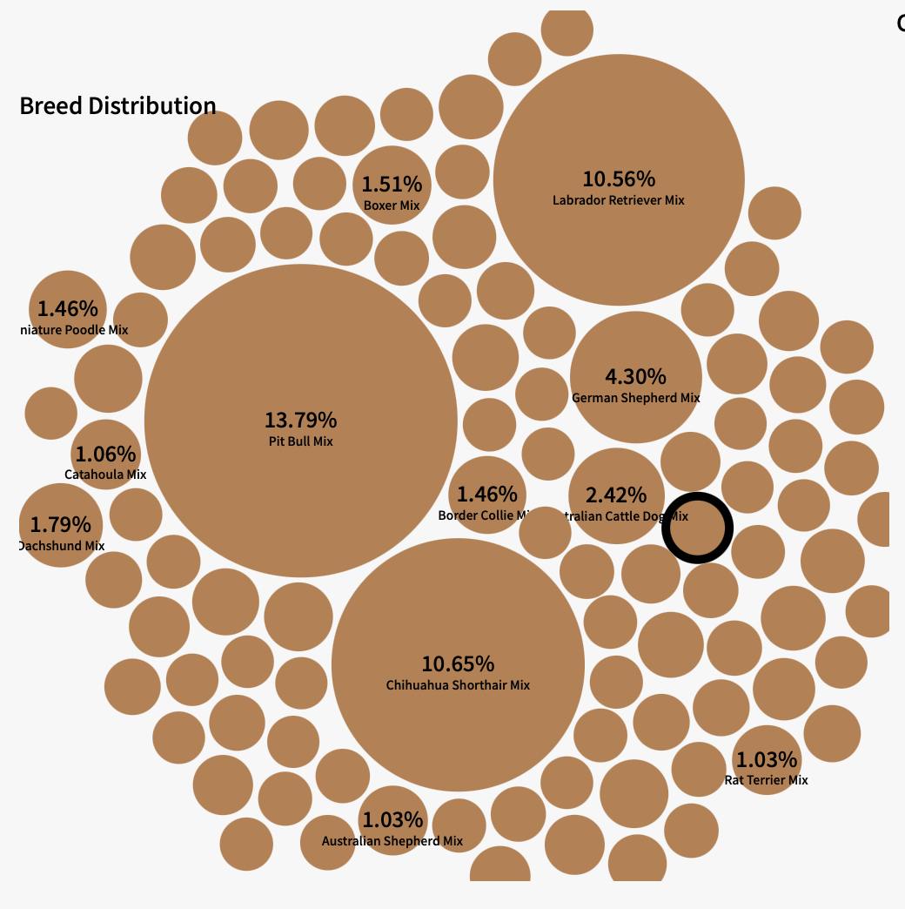

2. Filter Animal condition/Age

    
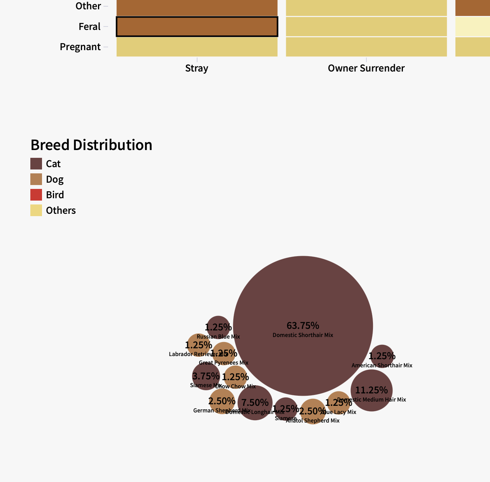

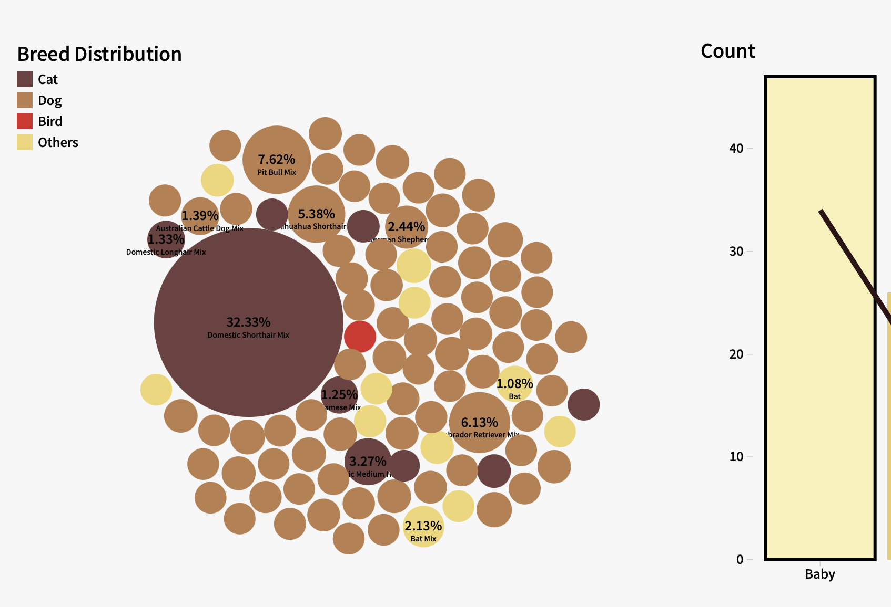

The user could use 5.2 Stack-line brush, 5.6 Bar chart, 5.4 Heat Map to filter 5.5 bubble plot.

5.6 Bar chart of Age Group VS Line chart of average Days in Shelter

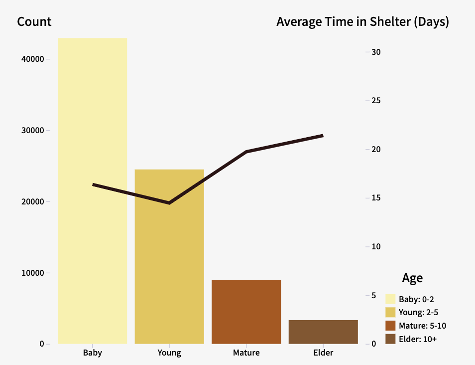

Visual Encoding

<table>
  <tr>
   <td>Attribute
   </td>
   <td>Type
   </td>
   <td>Marks
   </td>
   <td>Channel
   </td>
  </tr>
  <tr>
   <td>Age Group
   </td>
   <td>Categorical
   </td>
   <td>x axis
   </td>
   <td>color hue
   </td>
  </tr>
  <tr>
   <td>Avg time in shelter
   </td>
   <td>quantitative
   </td>
   <td>point
   </td>
   <td>position on common scale
   </td>
  </tr>
  <tr>
   <td>Animal Count
   </td>
   <td>quantitative
   </td>
   <td>line
   </td>
   <td>length
   </td>
  </tr>
</table>

Design Rationale

We have designed this chart with the x axis representing different age groups and the left y axis showing the number of animals in each group. The right y axis displays the average time that animals in each age group spend in shelters. 

To enhance its visual appeal, we made several design choices:

* We have assigned a unique color to represent each age group, with lighter colors used for younger ages.
* We categorized animals by the most common age groups to categorize cats and dogs .
* To avoid confusion when interpreting the chart, we have implemented a feature where hovering over bars highlights the left y-axis with bold font while hovering over lines highlights the right y-axis with bold font.

Interaction (DONE)

Creating a filter:

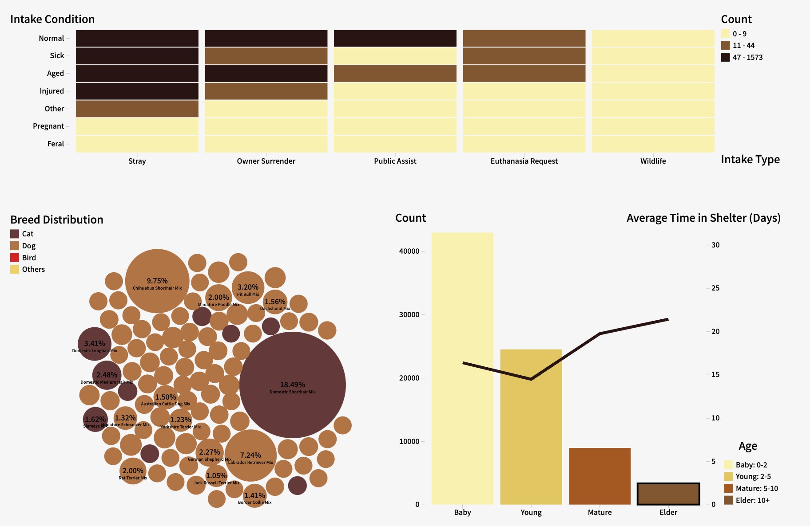

    When a user clicks on a bar in the chart, it filters the data based on the age group. The barl will be lightlighted with a black border. The filter is applied to the bubble chart to display the breed distribution of animals that fall under this age group. The filter also applies to the heatmap, which shows the count of each combinations of the intake condition and intake type for animals that fall under this age group.

Receiving a filter:

    
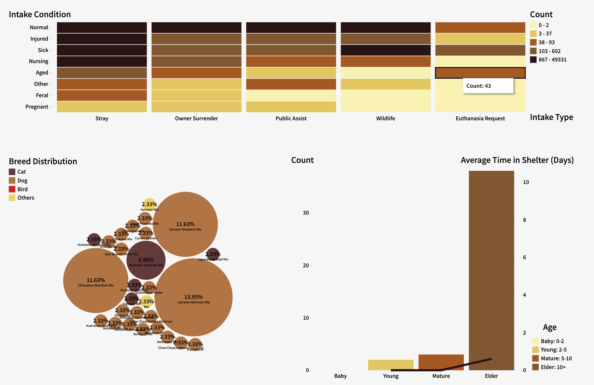

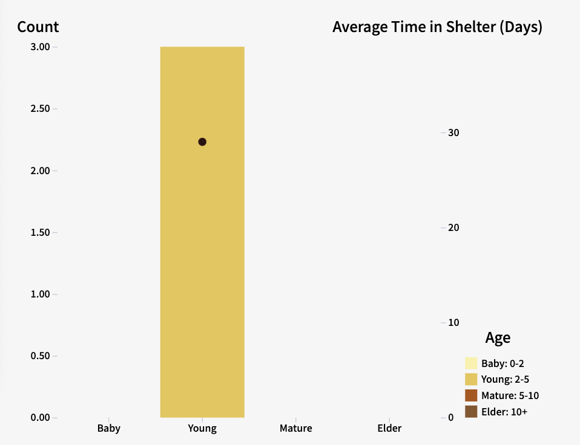

    The bar and line chart can receive filtered data from all the other filters in the app. When receiving filtered data from other charts, the barchart adjusts accordingly by changing the number of bars based on how many age groups are present. However, if there is only one age group present, a line cannot be formed and instead a point will be generated to represent the average time spent in shelter.

Filter Combination

	5.6 Bar chart selector could be used together with 5.1 type filter, and if there is a selected 5.2 stack brush, the user could use 5.5 based on 5.2 selection.

Hover & Tooltip (DONE)

    
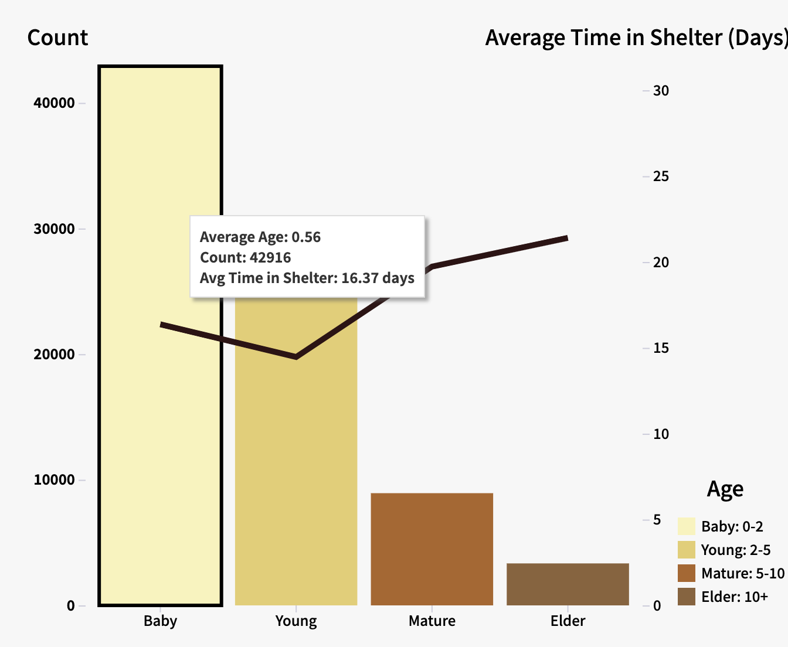

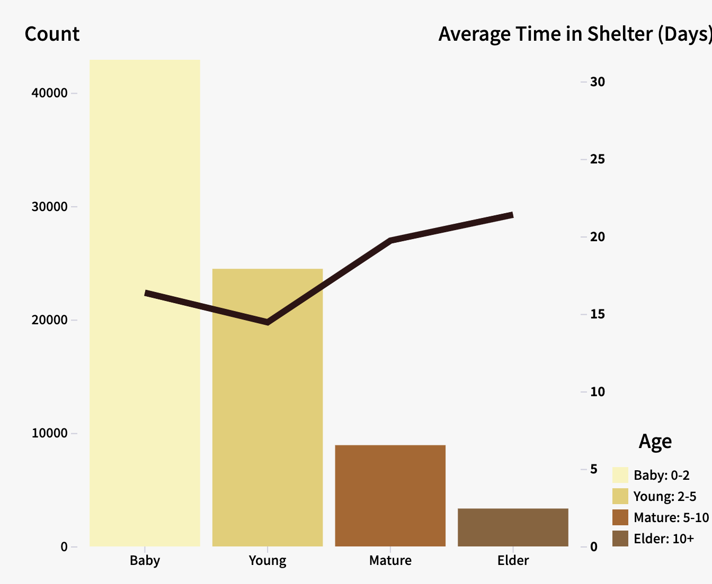

    When a user mouseover a bar, it would hover and show tooltip with animal average age in this group, count and average time in shelter. Hovering over bars highlights the left y-axis with bold font while hovering over lines highlights the right y-axis with bold font.

## 6 Usage Scenarios

Linda had been dreaming of adopting a pet for a long time. Finally, after moving to a larger house, she had the space and time to do so. She decided to visit the website of the nearby animal shelter to find out what kind of pet would be the perfect fit for her.

Upon visiting the website, Linda was impressed with the variety of data visualization tools that were available to help her with her search. She noticed an animal type filter at the top of the webpage, which allowed her to filter the animals by type. By clicking the button, she could see the data of each animal type, and find out more about them.

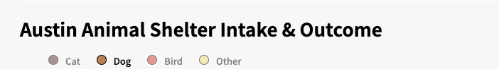

Linda was curious about which animals were most popular at the shelter, so she looked at the stacked line chart. This chart showed the intake and outcome numbers over time, which gave her an idea of the overall animal population at the shelter. She was surprised to find that dogs were the most popular animals at the shelter, with the highest outcome and intake numbers.
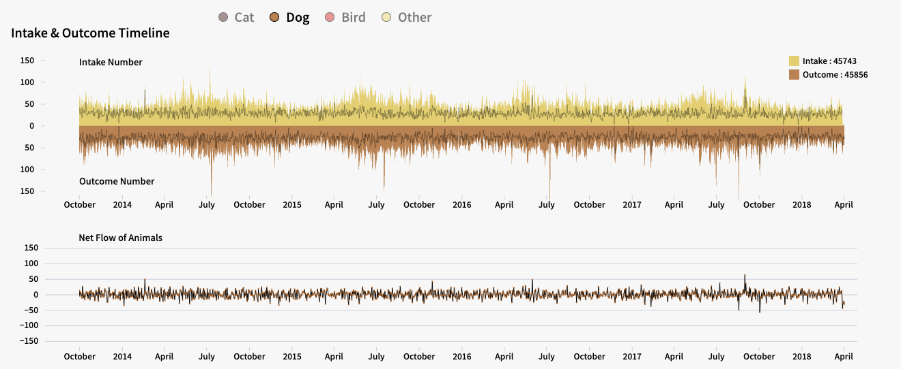

Then, Linda tried to select a random period of time to see the animal flows in one period.

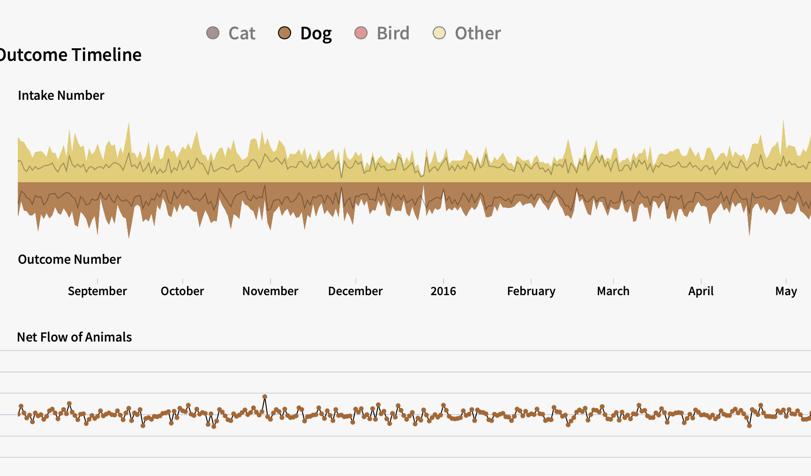

Next, Linda looked at the bubble chart, which showed the breed distribution of each animal type. She was happy to see that there were many breeds of dogs available, but noticed that pit bulls consisted of a large group of dogs. So she click pit bull mix to filter only pit pull.

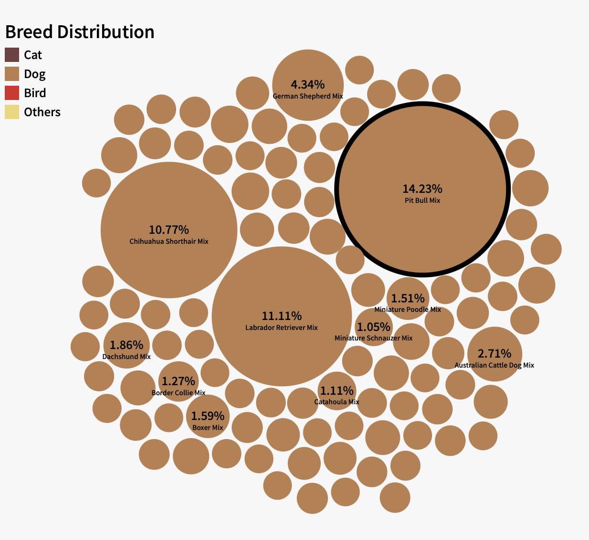

From the heatmap, she was concerned to see that a lot of the pit bulls were taken to the shelter because they were injured as she could tell the number range from the color of each rectangle and it would show a tooltip when her mouse moved to a single rectangle. Linda is a kind-hearted person and wanted to provide a loving home to an animal in need, so she decided to adopt a pit bull.

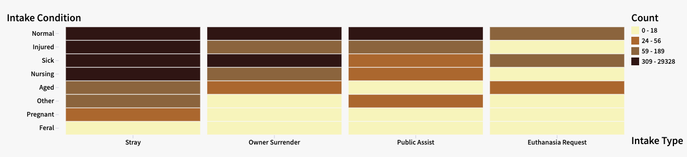

Linda then looked at the bar chart, which showed the age distribution of the pit bulls. She noticed that most of the pit bulls were in the young age range of 0-2 years old. Linda wanted to adopt a young dog, so she decided to adopt a pit bull within that age range.

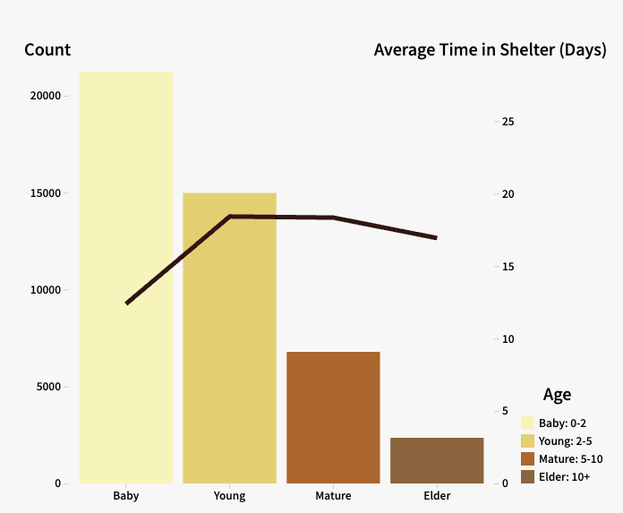

Finally, Linda made an appointment to visit the shelter in person. She was excited to meet the pit bull she had chosen and see if they would be a good match. When she arrived, she was greeted warmly by the staff and shown around the facility. She spent some time with the pit bull, getting to know its temperament and personality. She found that they got along well and decided to adopt the dog.

Thanks to the data visualization tools on the animal shelter's website, Linda was able to make an informed decision and adopt the perfect pet for her. She was grateful for the tools that helped her navigate the adoption process and find the right animal for her family. She was excited to give her new pit bull a loving home and provide the care it needed.

## 7 Credits

Color Palette

	[https://www.color-hex.com/color-palette/17962](https://www.color-hex.com/color-palette/17962)

	We used common dog fur colors found on this website as the main color scheme for the webpage. 

Bubble Chart

[https://gist.github.com/officeofjane/a70f4b44013d06b9c0a973f163d8ab7a](https://gist.github.com/officeofjane/a70f4b44013d06b9c0a973f163d8ab7a)

The simulation function of bubbles was taken from this github repo. We adapt the charge/force/collision formula to make the chart more readable.

[https://d3-graph-gallery.com/graph/circularpacking_template.html](https://d3-graph-gallery.com/graph/circularpacking_template.html)

The drag function of bubbles was taken from this tutorial. We use only mouseover/mouseleave function to simplify the operation.

Bar & Line Chart

[https://stackoverflow.com/questions/66060548/d3-js-line-chart-not-updating-properly-when-applying-the-general-update-pattern](https://stackoverflow.com/questions/66060548/d3-js-line-chart-not-updating-properly-when-applying-the-general-update-pattern)

We use the similar join pattern in this link with line chart to make the filter work properly.

Heatmap \
	[https://d3-graph-gallery.com/graph/heatmap_style.html](https://d3-graph-gallery.com/graph/heatmap_style.html)

	We read this tutorial before generating a basic idea of the heatmap framework.

Stacked Area Chart

[https://d3-graph-gallery.com/stackedarea.html](https://d3-graph-gallery.com/stackedarea.html)

We read the code on the website before started to implement stacked line graph.

Time filter & brush

[https://codesandbox.io/s/github/UBC-InfoVis/2021-436V-examples/tree/master/d3-brushing-linking](https://codesandbox.io/s/github/UBC-InfoVis/2021-436V-examples/tree/master/d3-brushing-linking)

we read the brush implementation before using brush on our graph.
